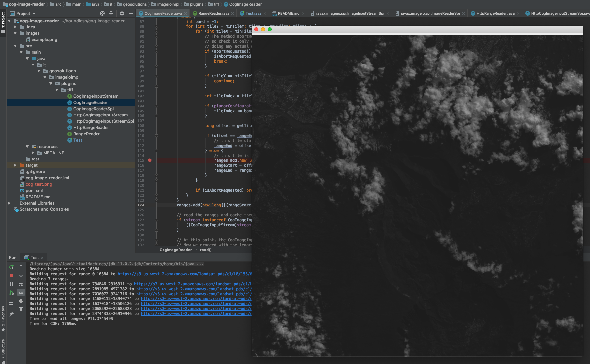

# Cloud Optimized GeoTIFF Reader 

### Overview
Cloud Optimized GeoTIFF (COG) reader for imageio-ext.   

The current GeoTools [GeoTiffReader](https://github.com/geotools/geotools/blob/master/modules/plugin/geotiff/src/main/java/org/geotools/gce/geotiff/GeoTiffReader.java) 
uses the imageio-ext [TIFFImageReader](https://github.com/geosolutions-it/imageio-ext/blob/master/plugin/tiff/src/main/java/it/geosolutions/imageioimpl/plugins/tiff/TIFFImageReader.java) 
to handle the reading of GeoTIFF files using a provided ImageInputStream.  The TIFFImageReader will determine which tiles 
or strips fall within the requested pixel coordinates and loop through each row/column to read and then decode each 
tile.  For COG, we wish to read contiguous byte ranges of consecutive tiles to reduce the number of reads required to 
obtain the requested data.

This project seeks to support Cloud Optimized GeoTIFFs without rewriting any of the low level GeoTIFF code that is 
already provided with imageio-ext.  The strategy is to determine which byte ranges must be read and use some new 
mechanism to read them (preferably asynchronously) and store them in the ImageInputStream used by the TIFFImageReader.
This prevents us from having to modify existing logic and allows the TIFFImageReader to continue to read and decode each 
tile individually, as the bytes have already been read into memory.

[CogImageReader](./src/main/java/it/geosolutions/imageioimpl/plugins/tiff/CogImageReader.java) extends from TIFFImageReader 
and overrides the `read` method.  It provides the logic to determine which byte ranges need to be read before passing 
the request on to TIFFImageReader's `read` method. 

[RangeReader](./src/main/java/it/geosolutions/imageioimpl/plugins/tiff/RangeReader.java) is a newly introduced interface. 
This interface can be implemented by any library to execute asynchronous block reads.  Currently an HTTP implementation 
is provided: [HttpRangeReader](./src/main/java/it/geosolutions/imageioimpl/plugins/tiff/HttpRangeReader.java).  The 
HttpRangeReader class is also responsible for eagerly fetching the COG's header upon instantiation.  Currently, 
it is statically coded to fetch the first 16KB (mimicking the default behavior of GDAL).  This should be changed to be 
configurable in the future.  The class also contains logic to prevent re-reading data from supplied byte ranges if the 
byte ranges fall inside of the header range that has already been read. 

[CogImageInputStream](./src/main/java/it/geosolutions/imageioimpl/plugins/tiff/CogImageInputStream.java) is an interface 
that defines a single method, `readRanges`, and accepts a 2D long array as a method parameter containing all of the 
start and end byte positions that need to be read.  The CogImageReader checks to see if the ImageInputStream being used 
is an instance of this class to determine if it should attempt to build and fetch the byte ranges.  If the 
ImageInputStream does not implement CogImageInputStream, CogImageReader will simply pass the request on to TIFFImageReader. 
I will likely provide S3, Azure, and Google Cloud implementations in the future.
 
[HttpCogImageInputStream](./src/main/java/it/geosolutions/imageioimpl/plugins/tiff/HttpCogImageInputStream.java) is an 
ImageInputStream implementation that uses the [HttpRangeReader](./src/main/java/it/geosolutions/imageioimpl/plugins/tiff/HttpRangeReader)  
to perform asynchronous range requests and store the resultant data in a delegate MemoryCacheImageInputStream.  
 
This project is still very much in the prototype stage and still needs better error handling, logging, tests, etc.  The 
package name aligns with the imageio-ext TIFFImageReader to take advantage of protected class members.  There are still 
some private methods and variables in TIFFImageReader that require duplication of code and use of reflection in 
CogImageReader.  

### Performance
To quickly benchmark performance between the CogImageReader and the TIFFImageReader, I averaged the amount of time it 
took to to produce the final image with 10 and 50 consecutive requests. All tests used 
https://s3-us-west-2.amazonaws.com/landsat-pds/c1/L8/153/075/LC08_L1TP_153075_20190515_20190515_01_RT/LC08_L1TP_153075_20190515_20190515_01_RT_B2.TIF 
as the target image.

Reading 1000x1000 pixels from an offset of 2000, 2000:

| Number of Requests | CogImageReader (ms) | TIFFImageReader (ms) | Delta (ms) |
| ------------------ | -------------- | --------------- | ------ |
|        10          |      1586      |       4961      |  3272  |
|        50          |      1586      |       5305      |  3719  |

Reading 2000x2000 pixels from an offset of 0, 0:

| Number of Requests | CogImageReader (ms) | TIFFImageReader (ms) | Delta (ms) |
| ------------------ | -------------- | --------------- | ------ |
|        10          |      1029      |       2927      |  1898  |
|        50          |      1287      |       3418      |  2131  |

### Sample Debug Outputs
* Reading an entire image.  Because all tiles are contiguous, only 1 range request is made.  The byte locations, as 
calculated by CogImageReader, are modified by HttpCogImageInputStream as to not re-request data that was read in the 
header:
```
File size: 52468640
Reading header with size 16384
Building request for range 0-16384 to https://s3-us-west-2.amazonaws.com/landsat-pds/c1/L8/153/075/LC08_L1TP_153075_20190515_20190515_01_RT/LC08_L1TP_153075_20190515_20190515_01_RT_B2.TIF
Reading pixels at offset (0.0, 0.0) with a width of 8000.0px and height of 8000.0px
Reading tiles (0,0) - (14,15)
Modified range 2304-52468639 to 16385-52468639 as it overlaps with data previously read in the header request
Submitting 1 range request(s)
Building request for range 16385-52468639 to https://s3-us-west-2.amazonaws.com/landsat-pds/c1/L8/153/075/LC08_L1TP_153075_20190515_20190515_01_RT/LC08_L1TP_153075_20190515_20190515_01_RT_B2.TIF
Time to read all ranges: PT8.227302S
Time for COG: 9271ms
```
---
* Reading only the first tile.  No additional range requests are necessary as the first tile was actually fully read in 
the header request:
```
File size: 52468640
Reading header with size 16384
Building request for range 0-16384 to https://s3-us-west-2.amazonaws.com/landsat-pds/c1/L8/153/075/LC08_L1TP_153075_20190515_20190515_01_RT/LC08_L1TP_153075_20190515_20190515_01_RT_B2.TIF
Reading pixels at offset (0.0, 0.0) with a width of 500.0px and height of 500.0px
Reading tiles (0,0) - (0,0)
Removed range 2304-2834 as it lies fully within the data already read in the header request
Submitting 0 range request(s)
Time to read all ranges: PT0.000036S
Time for COG: 164ms
```
---
* Reading an arbitrary portion of the image.  Multiple range requests are required where the tiles are not contiguous:
```
File size: 52468640
Reading header with size 16384
Building request for range 0-16384 to https://s3-us-west-2.amazonaws.com/landsat-pds/c1/L8/153/075/LC08_L1TP_153075_20190515_20190515_01_RT/LC08_L1TP_153075_20190515_20190515_01_RT_B2.TIF
Reading pixels at offset (1208.0, 2684.0) with a width of 4893.0px and height of 3879.0px
Reading tiles (2,5) - (11,12)
No ranges modified.
Submitting 8 range request(s)
Building request for range 16540037-19858156 to https://s3-us-west-2.amazonaws.com/landsat-pds/c1/L8/153/075/LC08_L1TP_153075_20190515_20190515_01_RT/LC08_L1TP_153075_20190515_20190515_01_RT_B2.TIF
Building request for range 20916677-24108115 to https://s3-us-west-2.amazonaws.com/landsat-pds/c1/L8/153/075/LC08_L1TP_153075_20190515_20190515_01_RT/LC08_L1TP_153075_20190515_20190515_01_RT_B2.TIF
Building request for range 25035438-28262317 to https://s3-us-west-2.amazonaws.com/landsat-pds/c1/L8/153/075/LC08_L1TP_153075_20190515_20190515_01_RT/LC08_L1TP_153075_20190515_20190515_01_RT_B2.TIF
Building request for range 29320282-32580105 to https://s3-us-west-2.amazonaws.com/landsat-pds/c1/L8/153/075/LC08_L1TP_153075_20190515_20190515_01_RT/LC08_L1TP_153075_20190515_20190515_01_RT_B2.TIF
Building request for range 33603270-36705283 to https://s3-us-west-2.amazonaws.com/landsat-pds/c1/L8/153/075/LC08_L1TP_153075_20190515_20190515_01_RT/LC08_L1TP_153075_20190515_20190515_01_RT_B2.TIF
Building request for range 37723107-40946150 to https://s3-us-west-2.amazonaws.com/landsat-pds/c1/L8/153/075/LC08_L1TP_153075_20190515_20190515_01_RT/LC08_L1TP_153075_20190515_20190515_01_RT_B2.TIF
Building request for range 41935185-45115808 to https://s3-us-west-2.amazonaws.com/landsat-pds/c1/L8/153/075/LC08_L1TP_153075_20190515_20190515_01_RT/LC08_L1TP_153075_20190515_20190515_01_RT_B2.TIF
Building request for range 45872899-48895646 to https://s3-us-west-2.amazonaws.com/landsat-pds/c1/L8/153/075/LC08_L1TP_153075_20190515_20190515_01_RT/LC08_L1TP_153075_20190515_20190515_01_RT_B2.TIF
Time to read all ranges: PT3.836557S
Time for COG: 4463ms
```
---
